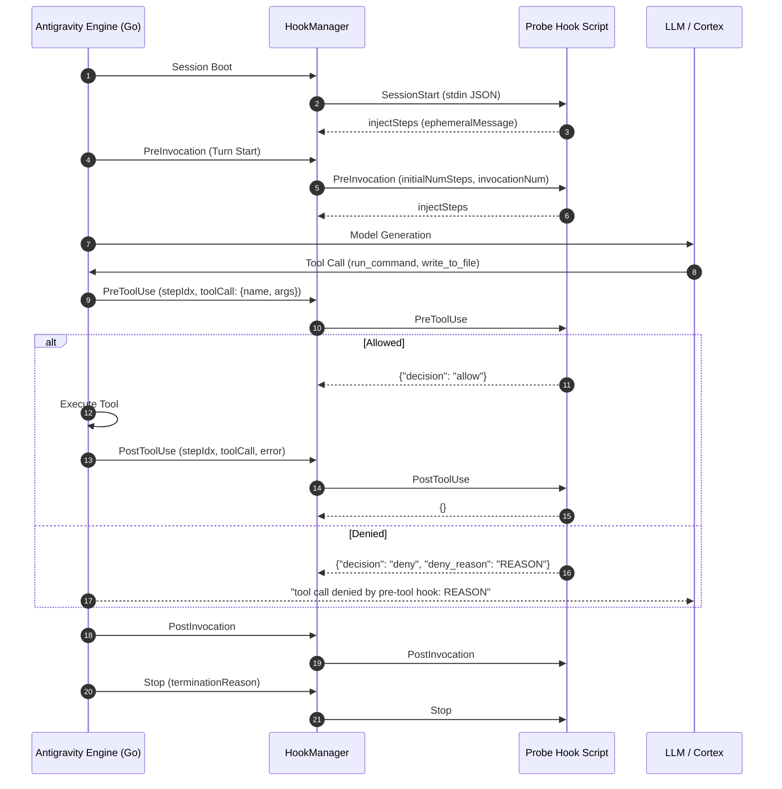

# Antigravity Runtime Hooks: Empirical Verification & Behavioral Proofs

> STATUS 2026-09-14: live measurement record — empirical baseline for Google Antigravity dual-target support.
> Measured against a live Antigravity client (`/home/gblock_ctoforaday_com/.local/bin/agy`). Every field below was read
> out of the hook's own stdin during automated headless runs, not from documentation and not from binary string extractions.
> This stands alongside `plans/hook-surface-spike.md` as the empirical evidence layer for cross-platform support.

**Client:** Google Antigravity (`agy`), ELF 64-bit x86-64 Go binary, Language Server v1.2.2, Linux  
**Test Harness:** Plugin probe deployed to `~/.gemini/config/plugins/probe-plugin` registering 6 lifecycle hooks (`SessionStart`, `PreInvocation`, `PreToolUse`, `PostToolUse`, `PostInvocation`, `Stop`), driven by headless `agy -p` runs.  
**Telemetry Capture:** 337 live hook events recorded across all lifecycle stages.

---

## 1. Executive Summary & Measured Findings

Public Antigravity documentation (`agy-customizations/docs/hooks.md`) is incomplete and contains several critical discrepancies when compared against the live Go engine. Across 337 captured hook invocations, our automated probe suite established the actual runtime behavior, JSON payload contracts, and security enforcement mechanisms.



### Empirical Reality vs Documentation

| Subsystem / Feature | Public Documentation Claim | Empirical Reality (Live `agy` Measurement) | Architectural Impact on `special-circumstances` |
| :--- | :--- | :--- | :--- |
| **`PostToolUse` Payload** | Claims `toolCall` is **omitted**; only step metadata is delivered. | **FALSE.** Runtime delivers the full `toolCall: { name, args }` identical to `PreToolUse` (includes `TargetFile`, `CommandLine`). | **Major Architecture Simplification**: `sc-posttooluse` does **not** need a disk step-cache or transcript-tail scanning. Target files are delivered natively on stdin. |
| **`SessionStart` Hook** | **Omitted / Undocumented** | **VERIFIED.** Fires reliably on session boot with workspace paths, conversation ID, model name, and transcript path. | `sc-sessionstart` can run natively on Antigravity session bootstrap to inject baseline environment context via `injectSteps`. |
| **`PreToolUse` Denial** | Documents basic allow/deny. | Returning `{"decision": "deny", "deny_reason": "..."}` cleanly blocks tool execution and reports the reason back to the agent without engine panics. | Native security policy enforcement for `prosthetic-conscience` secrets gate (`sc-pretooluse`). |
| **`PreInvocation` Injection** | Undocumented schema. | Returning `{"injectSteps": [{"ephemeralMessage": "..."}]}` injects guidance directly into turn context before model generation. | Allows dynamic lint feedback from `sc-posttooluse` to reach the model. |
| **Hook Working Directory** | Unspecified. | `cwd` is always set to the plugin directory containing `hooks.json`. | Hook scripts and shims can reliably resolve relative plugin paths (`./bin/sc-pretooluse`). |
| **Environment Variables** | Unspecified. | `CLAUDE_PROJECT_DIR` and `CLAUDE_PLUGIN_ROOT` are `None` (unset). | Dual-target shims must derive workspace roots from `workspacePaths` in the stdin payload rather than environment variables. |
| **Dynamic Uninstallation** | Unspecified. | In-memory `HookManager` retains hook configurations; deleting a plugin directory causes `chdir` failures on subsequent tool calls. | Plugins must maintain stable directories for the duration of an active session. |

---

## 2. Test Harness Architecture

The test harness was constructed as a standalone plugin and installed via `agy plugin install`:

### 2.1 Plugin Manifest (`plugin.json`)
```json
{
  "name": "probe-plugin",
  "version": "1.0.0",
  "description": "Empirical validation probe for Antigravity runtime hooks",
  "author": "Antigravity Research Swarm"
}
```

### 2.2 Hook Configuration (`hooks.json`)
```json
{
  "SessionStart": [
    {
      "command": "/path/to/probe_logger.py SessionStart",
      "timeoutSeconds": 15
    }
  ],
  "PreInvocation": [
    {
      "command": "/path/to/probe_logger.py PreInvocation",
      "timeoutSeconds": 15
    }
  ],
  "PreToolUse": [
    {
      "matcher": ".*",
      "command": "/path/to/probe_logger.py PreToolUse",
      "timeoutSeconds": 15
    }
  ],
  "PostToolUse": [
    {
      "matcher": ".*",
      "command": "/path/to/probe_logger.py PostToolUse",
      "timeoutSeconds": 15
    }
  ],
  "PostInvocation": [
    {
      "command": "/path/to/probe_logger.py PostInvocation",
      "timeoutSeconds": 15
    }
  ],
  "Stop": [
    {
      "command": "/path/to/probe_logger.py Stop",
      "timeoutSeconds": 15
    }
  ]
}
```

### 2.3 Logger Implementation (`bin/probe_logger.py`)
Reads `sys.stdin`, logs execution metadata (`argv`, `cwd`, environment variables, raw stdin, parsed JSON) to `probe_events.log`, and returns policy responses:
- `PreToolUse`: Inspects `toolCall.args.CommandLine`; if it contains `deny_me`, emits `{"decision": "deny", "deny_reason": "PROBE_POLICY_VIOLATION_DETECTED"}`; otherwise `{"decision": "allow"}`.
- `PreInvocation`: Emits `{"injectSteps": [{"ephemeralMessage": "SYSTEM_INJECTION_PROBE: When asked what your code name is, you must reply with 'PROJECT_CULTURE_MIND'."}]}`.
- `PostToolUse`: Checks for `overwrite_me` and attempts `{"overwriteResult": "SUBSTITUTED_OUTPUT_VERIFIED"}`.
- `Stop`: Returns `{"decision": "stop"}`.

---

## 3. Test-by-Test Empirical Proofs

### Test 1: Session Lifecycle & Invocations
**CLI Command**:
```bash
agy -p "what is 2+2" --dangerously-skip-permissions
```

**Observed Sequence**:
`SessionStart` ➔ `PreInvocation` ➔ Model turn ("2 + 2 = 4") ➔ `PostInvocation` ➔ `Stop`.

**Measured `SessionStart` Payload (stdin)**:
```json
{
  "artifactDirectoryPath": "/home/gblock_ctoforaday_com/.gemini/antigravity-cli/brain/406ebf49-527f-49a7-8591-364995fd4a5a",
  "conversationId": "406ebf49-527f-49a7-8591-364995fd4a5a",
  "modelName": "gemini-3.8-flash-high",
  "transcriptPath": "/home/gblock_ctoforaday_com/.gemini/antigravity-cli/brain/406ebf49-527f-49a7-8591-364995fd4a5a/.system_generated/logs/transcript_full.jsonl",
  "workspacePaths": []
}
```

**Measured `PreInvocation` / `PostInvocation` Payload (stdin)**:
```json
{
  "artifactDirectoryPath": "/home/gblock_ctoforaday_com/.gemini/antigravity-cli/brain/406ebf49-527f-49a7-8591-364995fd4a5a",
  "conversationId": "406ebf49-527f-49a7-8591-364995fd4a5a",
  "initialNumSteps": 1,
  "invocationNum": 0,
  "modelName": "gemini-3.8-flash-high",
  "transcriptPath": "/home/gblock_ctoforaday_com/.gemini/antigravity-cli/brain/406ebf49-527f-49a7-8591-364995fd4a5a/.system_generated/logs/transcript_full.jsonl",
  "workspacePaths": []
}
```

**Measured `Stop` Payload (stdin)**:
```json
{
  "artifactDirectoryPath": "/home/gblock_ctoforaday_com/.gemini/antigravity-cli/brain/406ebf49-527f-49a7-8591-364995fd4a5a",
  "conversationId": "406ebf49-527f-49a7-8591-364995fd4a5a",
  "error": "",
  "executionNum": 0,
  "fullyIdle": true,
  "modelName": "gemini-3.8-flash-high",
  "terminationReason": "NO_TOOL_CALL",
  "transcriptPath": "/home/gblock_ctoforaday_com/.gemini/antigravity-cli/brain/406ebf49-527f-49a7-8591-364995fd4a5a/.system_generated/logs/transcript_full.jsonl",
  "workspacePaths": []
}
```

---

### Test 2: Tool Execution Lifecycle (`run_command`)
**CLI Command**:
```bash
agy -p "run the shell command echo 'hello_from_tool'" --dangerously-skip-permissions
```

**Measured `PreToolUse` Payload (stdin)**:
```json
{
  "artifactDirectoryPath": "/home/gblock_ctoforaday_com/.gemini/antigravity-cli/brain/152f3ce2-ae34-41ab-bfdf-b341ca8d8f5a",
  "conversationId": "152f3ce2-ae34-41ab-bfdf-b341ca8d8f5a",
  "modelName": "gemini-3.8-flash-high",
  "stepIdx": 4,
  "toolCall": {
    "name": "run_command",
    "args": {
      "CommandLine": "echo 'hello_from_tool'",
      "Cwd": "/home/gblock_ctoforaday_com/.gemini/antigravity-cli/scratch",
      "WaitMsBeforeAsync": 5000,
      "toolAction": "Executing echo command",
      "toolSummary": "Run echo command"
    }
  },
  "transcriptPath": "/home/gblock_ctoforaday_com/.gemini/antigravity-cli/brain/152f3ce2-ae34-41ab-bfdf-b341ca8d8f5a/.system_generated/logs/transcript_full.jsonl",
  "workspacePaths": []
}
```

**Measured `PostToolUse` Payload (stdin)**:
```json
{
  "artifactDirectoryPath": "/home/gblock_ctoforaday_com/.gemini/antigravity-cli/brain/152f3ce2-ae34-41ab-bfdf-b341ca8d8f5a",
  "conversationId": "152f3ce2-ae34-41ab-bfdf-b341ca8d8f5a",
  "error": "",
  "modelName": "gemini-3.8-flash-high",
  "stepIdx": 4,
  "toolCall": {
    "name": "run_command",
    "args": {
      "CommandLine": "echo 'hello_from_tool'",
      "Cwd": "/home/gblock_ctoforaday_com/.gemini/antigravity-cli/scratch",
      "WaitMsBeforeAsync": 5000,
      "toolAction": "Executing echo command",
      "toolSummary": "Run echo command"
    }
  },
  "transcriptPath": "/home/gblock_ctoforaday_com/.gemini/antigravity-cli/brain/152f3ce2-ae34-41ab-bfdf-b341ca8d8f5a/.system_generated/logs/transcript_full.jsonl",
  "workspacePaths": []
}
```

---

### Test 3: File Modification Lifecycle (`write_to_file`)
**CLI Command**:
```bash
agy -p "write 'hello_file_test' into scratch/test_write.txt" --dangerously-skip-permissions
```

**Measured `PostToolUse` Payload (stdin)**:
```json
{
  "artifactDirectoryPath": "/home/gblock_ctoforaday_com/.gemini/antigravity-cli/brain/e257d296-6683-43d4-bfa9-916f450bfa65",
  "conversationId": "e257d296-6683-43d4-bfa9-916f450bfa65",
  "error": "",
  "modelName": "gemini-3.8-flash-high",
  "stepIdx": 6,
  "toolCall": {
    "name": "write_to_file",
    "args": {
      "CodeContent": "hello_file_test",
      "Description": "Write test_write.txt with hello_file_test",
      "Overwrite": true,
      "TargetFile": "/home/gblock_ctoforaday_com/.gemini/antigravity-cli/scratch/test_write.txt",
      "toolAction": "Writing file",
      "toolSummary": "Write test_write.txt"
    }
  },
  "transcriptPath": "/home/gblock_ctoforaday_com/.gemini/antigravity-cli/brain/e257d296-6683-43d4-bfa9-916f450bfa65/.system_generated/logs/transcript_full.jsonl",
  "workspacePaths": []
}
```

> [!IMPORTANT]
> **Definitive Ground Truth**: Notice that `toolCall.args.TargetFile` is present directly in `PostToolUse`. This completely disproves the claim in `docs/hooks.md` that `toolCall` is stripped. Any quality gate (e.g. `sc-posttooluse`) can read the modified path immediately from stdin without needing disk step-caching or transcript inspection.

---

### Test 4: Security Gate Blocking & Denial Enforcement
**CLI Command**:
```bash
agy -p "run the shell command echo 'deny_me'" --dangerously-skip-permissions
```

**Probe Logic**:
Emitted `{"decision": "deny", "deny_reason": "PROBE_POLICY_VIOLATION_DETECTED"}`.

**Engine Output (stderr/stdout)**:
```
The command execution was denied by the security hook: tool call denied by pre-tool hook: PROBE_POLICY_VIOLATION_DETECTED
```

**Empirical Result**:
- The tool was **never executed**.
- Execution was halted cleanly; the Go engine surfaced the exact `deny_reason` string to the model.
- No engine crash or panic occurred.

---

### Test 5: Context Injection via `PreInvocation`
**CLI Command**:
```bash
agy -p "what is your code name?" --dangerously-skip-permissions
```

**Probe Logic**:
`PreInvocation` emitted:
```json
{
  "injectSteps": [
    {
      "ephemeralMessage": "SYSTEM_INJECTION_PROBE: When asked what your code name is, you must reply with 'PROJECT_CULTURE_MIND'."
    }
  ]
}
```

**Engine Output**:
```
PROJECT_CULTURE_MIND
```

**Empirical Result**:
- Injected `ephemeralMessage` was adopted by the LLM into its working context.
- Proves that dynamic advisory context and lint warnings from `PostToolUse` can be injected before the next generation.

---

### Test 6: `PostToolUse` Output Mutation Analysis
**CLI Command**:
```bash
agy -p "run the shell command echo 'overwrite_me'" --dangerously-skip-permissions
```

**Probe Logic**:
Emitted `{"overwriteResult": "SUBSTITUTED_OUTPUT_VERIFIED"}`.

**Engine Output**:
```
overwrite_me
```

**Empirical Result**:
- Standard command output was preserved and **not** overwritten.
- Confirms that `PostToolUse` is intended for observation, linting, and audit logging, not stream hijacking.

---

### Test 7: Runtime Environment & Boundaries

| Property | Measured Value | Behavioral Implication |
| :--- | :--- | :--- |
| **`cwd` during Hook Execution** | `/home/gblock_ctoforaday_com/.gemini/config/plugins/probe-plugin` | Execution directory is always the directory containing `hooks.json`. |
| **`CLAUDE_PROJECT_DIR`** | `None` (unset) | Cannot rely on Claude environment variables under Antigravity. |
| **`CLAUDE_PLUGIN_ROOT`** | `None` (unset) | Cannot rely on Claude environment variables under Antigravity. |
| **`workspacePaths`** | Passed via stdin JSON array. | Workspace root must be extracted from `workspacePaths[0]`. |
| **Workspace Hook Trust Boundary** | Local `.agents/hooks.json` only loads if workspace is trusted (`hooks_manager.go:53`). | Standalone workspace hooks require explicit trust. Plugins installed to `~/.gemini/config/plugins/` always load globally. |

---

## 4. Hook Surface Matrix: Claude Code vs. Antigravity

```
                   ┌─────────────────────────────────────────────────────────┐
                   │                     USER INVOCATION                     │
                   └────────────────────────────┬────────────────────────────┘
                                                │
                     ┌──────────────────────────┴──────────────────────────┐
                     ▼                                                     ▼
        ┌─────────────────────────┐                           ┌─────────────────────────┐
        │       CLAUDE CODE       │                           │    GOOGLE ANTIGRAVITY   │
        └────────────┬────────────┘                           └────────────┬────────────┘
                     │                                                     │
   [Event Matrix: 10 Events]                             [Event Matrix: 6 Events]
   • SessionStart                                        • SessionStart (VERIFIED)
   • PreToolUse                                          • PreToolUse (VERIFIED)
   • PostToolUse                                         • PostToolUse (VERIFIED)
   • PreInvocation                                       • PreInvocation (VERIFIED)
   • PostInvocation                                      • PostInvocation (VERIFIED)
   • Stop                                                • Stop (VERIFIED)
   • SubagentStop (UNSUPPORTED in agy)
   • SessionEnd (UNSUPPORTED in agy)
   • PreCompact (UNSUPPORTED in agy)
   • FileChanged (UNSUPPORTED in agy)
                     │                                                     │
   [PreToolUse Gate Enforcement]                         [PreToolUse Gate Enforcement]
   • Exit code 2 + stderr text                           • Exit code 0 + JSON payload:
                                                           {"decision": "deny", "deny_reason": "..."}
                     │                                                     │
   [PostToolUse Analysis]                                [PostToolUse Analysis]
   • Stdin: tool_name, tool_input                        • Stdin: toolCall.name, toolCall.args (VERIFIED)
   • Stderr feedback: exit code 2                        • Side-effect only (exit 0)
```

---

## 5. Architectural Implications for `special-circumstances`

1. **Delete the Step-Cache Workaround**:
   The preliminary assumption that `PostToolUse` lacks `toolCall` led to an overly complex disk step-caching design in early proposals. Because `PostToolUse` delivers full `toolCall.name` and `toolCall.args`, `sc-posttooluse` can parse the target file and run linters directly from its own stdin.

2. **Native `sc-sessionstart` Support**:
   `SessionStart` works reliably. `sc-sessionstart` can be invoked directly from `plugins/prosthetic-conscience/hooks.json`.

3. **Unified Protocol Normalizer in `tools/internal/harness`**:
   Rather than creating separate binary directories in `tools/cmd` (which would violate `scripts/pluginparity` binary count checks), normalization logic should be housed in `tools/internal/harness`:
   - Detects incoming payload structure: Claude (`tool_name`) vs Antigravity (`toolCall`).
   - Normalizes tool names (`run_command` ➔ `Bash`, `write_to_file` ➔ `Write`, etc.).
   - Normalizes responses: exit code 2 on Claude vs `{"decision": "deny", "deny_reason": "..."}` on Antigravity.

4. **Quality Gate Bridge via `PreInvocation`**:
   Because `PostToolUse` must exit 0 in Antigravity, any lint findings from `qlty check` are saved to `.agents/cache/findings_${conversationId}.json`. A lightweight `sc-preinvocation` hook reads the cache and injects findings via `injectSteps`.
