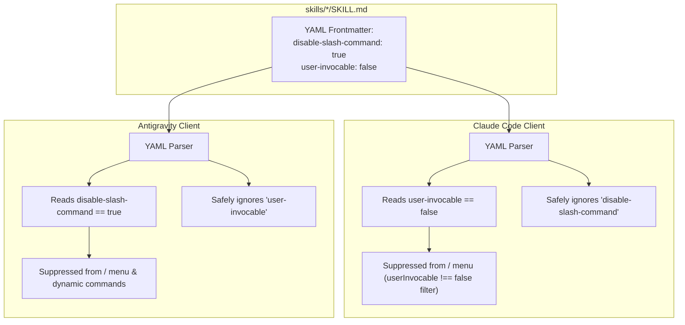

# Hide Non-User-Facing Skills from Slash Commands

> STATUS 2026-09-15: proposal — feature request & implementation plan.
> Discovered through empirical reverse-engineering of the Antigravity engine (`/home/gblock_ctoforaday_com/.local/bin/agy`).
> Solves the command-palette pollution defect when sharing skills between Claude Code and Antigravity.

---

## 1. Problem Statement & Motivation

In the [`special-circumstances`](file:///home/gblock_ctoforaday_com/projects/special-circumstances) repository, capabilities are split into two distinct tiers across all 37 skills in the tree:

1. **User-Facing Operator & Entry-Point Skills (12 total)**:
   Interactive verbs intended for the human operator to type directly in the chat prompt as slash commands across both Claude Code and Antigravity:
   - **All 10 Migrated Former Commands** (ensuring unified cross-engine compatibility):
     - `prosthetic-conscience` (5): `/prosthetic-conscience:checkpoint`, `/prosthetic-conscience:doctor`, `/prosthetic-conscience:plan-audit`, `/prosthetic-conscience:probe`, `/prosthetic-conscience:resume`
     - `gray-area` (4): `/gray-area:audit-checkpoint`, `/gray-area:audit-pr-body`, `/gray-area:audit-repetition`, `/gray-area:audit-seat-coverage`
     - `frank-exchange-of-views` (1): `/frank-exchange-of-views:research`
   - **Core Operator Workflow Skills (2)**:
     - `frank-exchange-of-views` (1): `/frank-exchange-of-views:adversarial-audit`
     - `gray-area` (1): `/gray-area:elicitation-testing`
   - **Visibility Policy**: Every skill that was a command, plus the core workflow skills, **is intended to be visible**. None of these 12 skills may carry `disable-slash-command: true` or `user-invocable: false`.

2. **Agent Cognitive & Internal Procedural Skills (25 total)**:
   Internal cognitive runbooks, guardrails, and protocols meant for autonomous model discovery rather than human invocation:
   - The **22 procedural runbooks and guardrails** in [`plugins/prosthetic-conscience/skills/`](file:///home/gblock_ctoforaday_com/projects/special-circumstances/plugins/prosthetic-conscience/skills):
     `agent-guardrails`, `anti-spinning`, `complete-the-concept`, `context-checkpointing`, `context-efficiency`, `critical-stance`, `design-by-contract`, `facts-are-fields`, `git-proficiency`, `markdown-proficiency`, `pair-programming`, `plan-act-reflect`, `project-memory`, `qlty-proficiency`, `refactoring-safety`, `scratch-policy`, `semantic-consent`, `spec-driven-development`, `terse-communication`, `test-driven-development`, `think-around-problem`, `validation-loop`.
   - `plugins/frank-exchange-of-views/skills/research-protocol/SKILL.md` (internal debate protocol).
   - `plugins/gray-area/skills/restart-recovery/SKILL.md` (internal crash/reboot recovery runbook).
   - `plugins/gray-area/skills/telepathy/SKILL.md` (internal trajectory query runbook).
   - **Visibility Policy**: All 25 must carry both `disable-slash-command: true` and `user-invocable: false`.

### The Command Palette Flooding Defect
- In **Claude Code**, every skill registers as `/<plugin>:<name>` in the human operator's `/` autocomplete menu, which is what `user-invocable: false` suppresses. Measured 2026-09-17 on 2.1.274: a session registered `prosthetic-conscience:checkpoint` and its siblings, and no BARE `/checkpoint`, `/resume`, `/plan-audit` or `/probe` — the namespaced form is the one that resolves.
- In **Antigravity (Jetski)**, the engine's default behavior (`rebuildDynamicCommandsWithSkills`) scans all discovered skills in `skills/` and **automatically registers each one as an interactive slash command**.
- **Defect**: When an operator types `/` in Antigravity, the menu is flooded with 25 procedural engineering rules (`/agent-guardrails`, `/anti-spinning`, etc.). The actual operator commands (`/doctor`, `/checkpoint`, `/research`, etc.) are buried under noise, creating cognitive friction and accidental execution risks.

---

## 2. Technical Discovery: How Antigravity Controls Skill Visibility

Direct reverse engineering of `/home/gblock_ctoforaday_com/.local/bin/agy` (ELF 64-bit Go binary, Language Server v1.2.2) uncovered a native, undocumented frontmatter attribute designed specifically for this purpose:

### 2.1 Binary Evidence
```
Binary Offset 0x618289a:
"- Added a `disable-slash-command: true` flag for a skill's `SKILL.md` frontmatter,
 which hides that skill from the `/` menu and from `/name` resolution while leaving
 it discoverable and invocable by the model, so a large skill library no longer
 floods the command menu."

Binary Offset 0xa7fec96: protobuf:"varint,11,opt,name=disable_slash_command,json=disableSlashCommand,proto3"
```

### 2.2 Mechanism & Contract
When `disable-slash-command: true` is present in `SKILL.md` frontmatter:
1. **Hidden from UI Autocomplete**: The skill is excluded from the `/` popup menu in the TUI/IDE.
2. **Hidden from Slash Resolution**: Typing `/skill-name` does not expand or execute as a prompt command.
3. **100% Model Discoverable**: The skill **remains fully active** in the `Available skills` section of the system prompt. The model can autonomously discover, read, and invoke it via progressive disclosure (`view_file` on `SKILL.md`).

---

## 3. Technical Discovery: How Claude Code Controls Skill Visibility

Decompilation of Claude Code (`/home/gblock_ctoforaday_com/.local/share/claude/versions/2.1.270`, v2.1.270) reveals that Claude Code also has a first-class, native frontmatter flag to hide skills from user slash commands:

### 3.1 Code Evidence in Claude Code
```javascript
// Skill frontmatter parser:
let _ = e["user-invocable"] === void 0 ? !0 : Dot(e["user-invocable"]);
return {
  ...
  userInvocable: _,
  disableModelInvocation: Dot(e["disable-model-invocation"]),
};

// Slash command menu population:
skills: Il(w.skills, "name").filter((ee) => ee.userInvocable !== !1).map((ee) => ee.name)

// Interactive execution guard:
if (r.userInvocable === !1)
  return {
    messages: [
      `This skill can only be invoked by Claude, not directly by users. Ask Claude to use the "${r.name}" skill instead.`
    ]
  };
```

### 3.2 Mechanism & Contract
When `user-invocable: false` is present in `SKILL.md` frontmatter:
1. **Filtered from Interactive Palette:** Claude Code's slash menu explicitly filters `ee.userInvocable !== false`.
2. **Guarded from Direct Execution:** If typed directly, Claude blocks it with user guidance.
3. **Retained for Model Execution:** The model can autonomously invoke the skill unless `disable-model-invocation: true` is also present.

---

## 4. The Unified Frontmatter Architecture

By declaring **both** flags in `SKILL.md`, a skill is hidden from slash commands in both engines simultaneously with zero cross-engine validation warnings:

```yaml
---
name: spec-driven-development
description: Procedural methodology for SDD changes.
disable-slash-command: true   # Suppresses slash command in Google Antigravity
user-invocable: false          # Suppresses slash command in Anthropic Claude Code
---
```



---

## 5. Implementation Plan

### Phase 1: Dual Frontmatter Annotation (25 Non-User-Facing Skills)
Annotate all 25 internal procedural skills across all three plugins with dual frontmatter flags:
```yaml
---
name: <skill-name>
description: ...
disable-slash-command: true
user-invocable: false
---
```

Skills annotated (25 total):
1. **`prosthetic-conscience` (22 procedural rules)**:
   - `agent-guardrails`, `anti-spinning`, `complete-the-concept`, `context-checkpointing`, `context-efficiency`, `critical-stance`, `design-by-contract`, `facts-are-fields`, `git-proficiency`, `markdown-proficiency`, `pair-programming`, `plan-act-reflect`, `project-memory`, `qlty-proficiency`, `refactoring-safety`, `scratch-policy`, `semantic-consent`, `spec-driven-development`, `terse-communication`, `test-driven-development`, `think-around-problem`, `validation-loop`
2. **`frank-exchange-of-views` (1 internal protocol)**:
   - `research-protocol`
3. **`gray-area` (2 internal runbooks)**:
   - `restart-recovery`
   - `telepathy`

### Phase 2: CI Frontmatter Gate & Invariant
In `scripts/frontmatter` and `scripts/check`:
- Ensure all 25 cognitive and procedural skills carry both `disable-slash-command: true` and `user-invocable: false`.
- **Operator Command Exemption & Guard**: Assert that all 12 operator/workflow skills (the 10 former commands plus the 2 workflow skills) **do NOT** carry hiding flags. If someone marks any of the 10 migrated commands hidden, the gate must reject it:
  *"Everything that was a command is intended to be visible — do not mark former commands hidden."*

### Phase 3: Operator Command & Workflow Parity (12 Visible Skills)
Retain these 12 skills as visible, user-invocable slash commands across both Claude Code and Antigravity, carrying neither hiding flag:

1. **`prosthetic-conscience` (5 migrated entry points)**:
   - `/prosthetic-conscience:checkpoint`
   - `/prosthetic-conscience:doctor`
   - `/prosthetic-conscience:plan-audit`
   - `/prosthetic-conscience:probe`
   - `/prosthetic-conscience:resume`
2. **`gray-area` (4 migrated entry points + 1 operator workflow)**:
   - `/gray-area:audit-checkpoint`
   - `/gray-area:audit-pr-body`
   - `/gray-area:audit-repetition`
   - `/gray-area:audit-seat-coverage`
   - `/gray-area:elicitation-testing`
3. **`frank-exchange-of-views` (1 migrated entry point + 1 operator workflow)**:
   - `/frank-exchange-of-views:research`
   - `/frank-exchange-of-views:adversarial-audit`

Both Claude Code and Antigravity cleanly present all 12 operator entry points in the interactive `/` palette, while the model retains 100% autonomous access to all 25 procedural cognitive skills.
