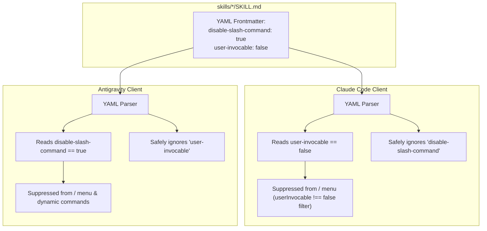

# Hide Non-User-Facing Skills from Slash Commands

> STATUS 2026-09-15: proposal — feature request & implementation plan.
> Discovered through empirical reverse-engineering of the Antigravity engine (`/home/gblock_ctoforaday_com/.local/bin/agy`).
> Solves the command-palette pollution defect when sharing skills between Claude Code and Antigravity.

---

## 1. Problem Statement & Motivation

In the [`special-circumstances`](file:///home/gblock_ctoforaday_com/projects/special-circumstances) repository, capabilities are split into two distinct tiers:

1. **User-Facing Commands (`commands/*.md`)**:
   Interactive verbs intended for the human operator to type directly in the chat prompt:
   - `/doctor` (`commands/doctor.md`)
   - `/checkpoint` (`commands/checkpoint.md`)
   - `/resume` (`commands/resume.md`)
   - `/plan-audit` (`commands/plan-audit.md`)
   - `/probe` (`commands/probe.md`)

2. **Agent Cognitive Skills (`skills/*/SKILL.md`)**:
   The **22 procedural runbooks and guardrails** in [`plugins/prosthetic-conscience/skills/`](file:///home/gblock_ctoforaday_com/projects/special-circumstances/plugins/prosthetic-conscience/skills):
   `agent-guardrails`, `anti-spinning`, `complete-the-concept`, `context-checkpointing`, `context-efficiency`, `critical-stance`, `design-by-contract`, `facts-are-fields`, `git-proficiency`, `markdown-proficiency`, `pair-programming`, `plan-act-reflect`, `project-memory`, `qlty-proficiency`, `refactoring-safety`, `scratch-policy`, `semantic-consent`, `spec-driven-development`, `terse-communication`, `test-driven-development`, `think-around-problem`, `validation-loop`.

### The Command Palette Flooding Defect
- In **Claude Code**, skills are model-facing instructions. They do not automatically populate the human operator's `/` command autocomplete menu unless explicitly declared in `commands/`.
- In **Antigravity (Jetski)**, the engine's default behavior (`rebuildDynamicCommandsWithSkills`) scans all discovered skills in `skills/` and **automatically registers each one as an interactive slash command**.
- **Defect**: When an operator types `/` in Antigravity, the menu is flooded with 22 procedural engineering rules (`/agent-guardrails`, `/anti-spinning`, etc.). The actual operator commands (`/doctor`, `/checkpoint`) are buried under noise, creating cognitive friction and accidental execution risks.

---

## 2. Technical Discovery: How Antigravity Controls Skill Visibility

Direct reverse engineering of `/home/gblock_ctoforaday_com/.local/bin/agy` (ELF 64-bit Go binary, Language Server v1.2.2) uncovered a native, undocumented frontmatter attribute designed specifically for this purpose:

### 2.1 Binary Evidence
```
Binary Offset 0x618289a:
"- Added a `disable-slash-command: true` flag for a skill's `SKILL.md` frontmatter,
 which hides that skill from the `/` menu and from `/name` resolution while leaving
 it discoverable and invocable by the model, so a large skill library no longer
 floods the command menu."

Binary Offset 0xa7fec96: protobuf:"varint,11,opt,name=disable_slash_command,json=disableSlashCommand,proto3"
```

### 2.2 Mechanism & Contract
When `disable-slash-command: true` is present in `SKILL.md` frontmatter:
1. **Hidden from UI Autocomplete**: The skill is excluded from the `/` popup menu in the TUI/IDE.
2. **Hidden from Slash Resolution**: Typing `/skill-name` does not expand or execute as a prompt command.
3. **100% Model Discoverable**: The skill **remains fully active** in the `Available skills` section of the system prompt. The model can autonomously discover, read, and invoke it via progressive disclosure (`view_file` on `SKILL.md`).

---

## 3. Technical Discovery: How Claude Code Controls Skill Visibility

Decompilation of Claude Code (`/home/gblock_ctoforaday_com/.local/share/claude/versions/2.1.270`, v2.1.270) reveals that Claude Code also has a first-class, native frontmatter flag to hide skills from user slash commands:

### 3.1 Code Evidence in Claude Code
```javascript
// Skill frontmatter parser:
let _ = e["user-invocable"] === void 0 ? !0 : Dot(e["user-invocable"]);
return {
  ...
  userInvocable: _,
  disableModelInvocation: Dot(e["disable-model-invocation"]),
};

// Slash command menu population:
skills: Il(w.skills, "name").filter((ee) => ee.userInvocable !== !1).map((ee) => ee.name)

// Interactive execution guard:
if (r.userInvocable === !1)
  return {
    messages: [
      `This skill can only be invoked by Claude, not directly by users. Ask Claude to use the "${r.name}" skill instead.`
    ]
  };
```

### 3.2 Mechanism & Contract
When `user-invocable: false` is present in `SKILL.md` frontmatter:
1. **Filtered from Interactive Palette:** Claude Code's slash menu explicitly filters `ee.userInvocable !== false`.
2. **Guarded from Direct Execution:** If typed directly, Claude blocks it with user guidance.
3. **Retained for Model Execution:** The model can autonomously invoke the skill unless `disable-model-invocation: true` is also present.

---

## 4. The Unified Frontmatter Architecture

By declaring **both** flags in `SKILL.md`, a skill is hidden from slash commands in both engines simultaneously with zero cross-engine validation warnings:

```yaml
---
name: spec-driven-development
description: Procedural methodology for SDD changes.
disable-slash-command: true   # Suppresses slash command in Google Antigravity
user-invocable: false          # Suppresses slash command in Anthropic Claude Code
---
```



---

## 5. Implementation Plan

### Phase 1: Dual Frontmatter Annotation
Annotate all 22 procedural skills in [`plugins/prosthetic-conscience/skills/`](file:///home/gblock_ctoforaday_com/projects/special-circumstances/plugins/prosthetic-conscience/skills):
```yaml
---
name: agent-guardrails
description: ...
disable-slash-command: true
user-invocable: false
---
```

Skills to update:
1. `agent-guardrails`
2. `anti-spinning`
3. `complete-the-concept`
4. `context-checkpointing`
5. `context-efficiency`
6. `critical-stance`
7. `design-by-contract`
8. `facts-are-fields`
9. `git-proficiency`
10. `markdown-proficiency`
11. `pair-programming`
12. `plan-act-reflect`
13. `project-memory`
14. `qlty-proficiency`
15. `refactoring-safety`
16. `scratch-policy`
17. `semantic-consent`
18. `spec-driven-development`
19. `terse-communication`
20. `test-driven-development`
21. `think-around-problem`
22. `validation-loop`

### Phase 2: CI Frontmatter Gate
Add a check in `scripts/frontmatter` or `scripts/check` asserting that:
- Any skill in `plugins/prosthetic-conscience/skills/` has `disable-slash-command: true`.
- Verifies that new cognitive skills added in the future do not accidentally pollute the command palette.

### Phase 3: Operator Command Parity
Keep `commands/*.md` as the exclusive definitions for operator slash commands:
- `/doctor`
- `/checkpoint`
- `/resume`
- `/plan-audit`
- `/probe`

Antigravity will cleanly present only these 5 commands to the user, while the model retains seamless access to all 22 procedural skills.
