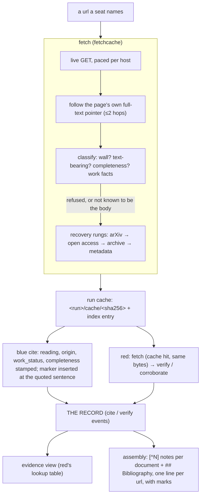

# Citations and the bibliography — how a source reaches the reader, and where it breaks

A citation in a FEOV report is built by the tool end to end. No seat hand-types a footnote, a
bibliography line or a hash. This page follows one source from the url a seat names to the line a
reader sees, then lists what is known to be wrong with the process. The second half matters as
much as the first.

## 1. Fetch — getting the bytes

`fetch` replaces WebFetch for every seat. It is a cached, hash-verified read, and both sides read
the same bytes.

**Asking politely.** The client identifies itself as this tool and impersonates no browser
(`TestTheAgentDoesNotImpersonateOrTripAGate`). Each host has a floor between requests: 15 s by
default, or the host's own `Crawl-delay` where that is larger. The floor is jittered over `[X, 2X)`,
shared across processes through a lock file, and doubled on a 429 or 5xx. robots.txt is read for
its `Crawl-delay` **only**: this tool is not a crawler, and obeying Disallow cost 5.4% of fetches
for no one's benefit (gblock's ruling). **One document is one asking**: a redirect chain, or a walk
from a landing page to its full text, charges each host once. An overload status (429, 425, 502–504) is retried once, after the host's own floor; nothing else is retried.

**Reading the answer.** Bodies are capped at 64 MiB. gzip and deflate are decoded; brotli and zstd
are refused by name. A doi resolves through Crossref's registered url rather than a `doi.org` hop.
When an html page names its own full text (`citation_fulltext_html_url`, `citation_pdf_url`,
Signposting `rel="item"`), fetch follows it, up to two hops, stopping at a page that names itself.
That hop is recorded as `followed_to`, not as a substitute copy.

**Classifying what arrived.** Every entry records what the bytes are, not only that they arrived:

- **`not_renderable`**: a wall (a challenge page, a proof-of-work gate, an unrendered app shell, or
  a page starved of prose). Its text is not the source's.
- **`text_retrieved`**: whether the bytes carry the source's text at all. An allowlist of
  text-bearing types; a zip or a `.ps.Z` is the document and not its text.
- **`completeness`**: which part of the work an html page or pdf is:
  - `full` only on **positive evidence**: the platform's own body-section markup before the reference
    list (Springer Nature `SecN`, PubMed Central `pmc_sec_title`), or a pdf at least half the page
    span the work declares.
  - `abstract` where the platform prints its paywall or page images in place of the body.
  - `not_the_work` for a sign-in form or a book's sales page.
  - `unverified` where nothing known could tell.
  - Empty where the question did not apply: a page not about a scholarly work, or a pdf with no
    declared span.
- **Work facts** from OpenAlex: retracted, paratext, work type, open-access status, licence, and the
  declared page span. They describe the paper, and no fetch of its bytes can discover them.
- **`tdm_reserved`**: the page's text-and-data-mining reservation. Reported, never enforced: it
  covers mining, not reading or quoting.

**Going further.** A page that is not known to be the body (`abstract`, `not_the_work`,
`unverified`) is not where the search ends. Fetch asks the two rungs that return the work itself:
- **arXiv**, by identifier.
- **Open access**: the union of OpenAlex, Semantic Scholar, DOAJ, Crossref's text-mining links,
  Europe PMC, and the PMC open-access bucket. Every PMC spelling is expanded to the routes NCBI
  sanctions.

Candidates are ranked, versions of record first. Each is verified at the leaf (fetched and
classified like any other answer), and the walk stops at the first that carries the body; at most
four are tried. A candidate whose host refuses, or whose document url answers with its abstract, is
asked of the web archive.

A copy replaces the page only if it carries the body: a pdf, an xml body, or a page marked full. A
pdf with no text layer replaces only a page known not to be the body. Otherwise the original page is
kept, and recorded as what it is.

**When the live fetch is refused**, the rungs run in the order arXiv → open access → archive →
metadata. The archive gives what a url said on a date: snapshots the archive itself recorded as
non-200 are rejected, and one is taken with the raw-bytes modifier. Metadata is a Crossref record,
`text_retrieved: false`. It is a legitimate `unread` citation that the work exists, never a reading.
`--via <rung>` asks one rung by name.

**Storing it.** Bytes live at `<run>/cache/<sha256>`, extracted text beside them at `<sha>.txt`, and
the index maps url → entry, first match winning. A second fetch of a url is a cache hit, so red
audits the exact bytes blue cited, never a page that drifted since. When the same bytes are cached
for two different urls, fetch prints `shared_body_with`: that is the shape of a wall, and the hash
then certifies the blockade.

## 2. Cite — putting it on the record

`blue cite --url --quote --title [--source-text leaf|summary_only|unread]` resolves the url
through the same cache. It records a `cite` event and inserts an invisible `<!--cite:c-…-->` marker
at the quoted sentence.

- **The reading is the seat's claim**, and it defaults to the weak one, `unread`. Two refusals keep
  it honest where the tool knows better:
  - `leaf` is refused on a copy recorded as the work's abstract or as not the work. `summary_only` is
    the reading an abstract can carry.
  - A `leaf` citation of OCR-derived text must name its span (`--ocr-quote`). The tool then records
    the pdf pages the span sits on.
- **The tool stamps the facts the seat cannot be asked to remember**, and a cite write missing one
  is refused:
  - `source_text_origin`: embedded, ocr or none.
  - `work_status`: standing, retracted, or not_checked.
  - `source_completeness`: full, abstract, unverified, not_the_work, or not_asked. Migrated runs
    carry `not_recorded` for the fields their epoch predates.
- **The anchor is immortal.** The report is a frozen base plus an ordered replay of edits and marker
  inserts. `blue edit` refuses any span that would drop or split an anchor, so the set of `cite`
  events and the anchors in the text stay in one-to-one correspondence; the scorecard's
  `unbacked_citations` flags any divergence. When blue rewrites the sentence around an anchor, the
  anchor stays, and the evidence view lists it under `reopened`: any verdict on it is now stale, and
  red re-reads those first.
- **The label** is `c-` plus 8 random hex digits, minted by the tool.

## 3. Red — checking it

Red fetches the cited url, a cache hit on blue's exact bytes, and records a verdict with
`lens verify` (a check of blue's citation) or `lens corroborate` (a source red found itself). The
outcome vocabulary has a negative half — `refutes` and `absent` are findings, not failures to grade.

- **`absent` is refused** on a copy recorded as abstract or not the work: an abstract's silence is
  not the work's.
- **`supports` from an abstract is allowed, and says so.** Every verdict naming a url is stamped
  with the copy's `source_completeness`. A support read off an abstract confirms what the abstract
  says, not what the study shows, and the record carries which.
- **A supporting corroboration becomes a footnote.** It carries a label and `work_status`, exactly
  as a blue cite does. A refuting or weak one is a board matter, never a reference.

The **evidence view** (`show evidence`) is red's lookup table. It lists each anchor with the
source's url, hash, title and quoted sentence, the stamped facts, and red's verdicts, plus
independent corroborations, reopened anchors, and contradictions nobody has raised a finding about.

## 4. Assembly — what the reader sees

Assembly weaves citations **per document** of the report set, because a footnote definition cannot
cross a file boundary. Finding markers are stripped; citation markers are resolved:

- Each anchor becomes `[^N]`, numbered by first appearance. Each note reads `Title, PDF p. N. url
  (accessed date)`: the page locator appears only for OCR quotes, and the date is the record's clock.
- `## Bibliography` has **one line per url**. Its title comes from a blue cite where one exists,
  otherwise from red's corroboration, and its access date is the earliest recorded.
- **Marks**, in the note and in the Bibliography, because a reader following one may never see the
  other:
  - `**[RETRACTED]**`: a fact about the work, so any citation of the url that carries it marks the
    Bibliography line.
  - `**[ABSTRACT ONLY]**`: a fact about the copy, so each note speaks for its own copy. The
    Bibliography line is marked only when *every* citation of the url rests on the abstract.
  - `unverified`, `not_asked` and `not_checked` print nothing. They are the tool's uncertainty,
    carried on the record for red rather than spent on the reader.
- An anchor with no source on the record is listed as `(unresolved citation …)`, never silently
  dropped.

## 5. Faults and flaws

Each item below is what the system does today, with the measurement or issue behind it. Several are
fundamental, not bugs.

**Reach — most of the literature is not openly readable, and some of what is cannot be reached
from here.**
- Over 397 works classified by who hosts an open copy: **51% had no open copy anywhere**, 9% were
  open only on a publisher's edge (behind Cloudflare, which challenges this cloud egress's network,
  AS396982), and 7% sat on hosts where our own defects were the cause. Those rates were measured
  **before** abstract pages were told apart from papers, so the retrieval rate then reported
  (34% retrieved, about 69% of what was obtainable) is inflated by abstracts counted as content. It
  has not been re-measured.
- The wall is the network, not the client. A browser-identical TLS client (httpcloak) and headless
  Chrome were both challenged exactly as our client was. Verified-bot schemes identify a
  centralised operator, which a per-user tool is not (#1129, #1128). A user on a residential or
  university network will reach more.
- PubMed Central gates its pdfs behind proof of work. The tool detects the gate and never solves
  it. Open-access-subset articles are reached through Europe PMC's API and the PMC bucket; the rest
  are not (#1115).
- JavaScript-rendered pages arrive as shells. They are detected (`not_renderable`), not rendered
  (#668, #263).
- A host that fails for any other reason — a timeout, a reset — is not retried within the fetch.
  Measured once: a repository that failed on one pass served its 20-page pdf on the next.

**Completeness — telling the paper from its abstract.**
- Only **two platforms** have a verified body marker (Springer Nature and PubMed Central, about 30%
  of the html pages measured). Everything else is `unverified`: kept, searched past, and never
  claimed full. The list is incomplete by design and fails safe, but `unverified` is common. The
  hand-read corpus behind the markers is 13 pages (`internal/fetchcache/testdata/bodies`).
- The pdf rule rests on 20 retrieved pdfs, one of which was short (10 of 165 pages). "A pdf is the
  document" has one known exception: an index listed a book's 23-page front matter as its open copy.
  Book pdfs are therefore `unverified`.
- Searching past a page that is not known to be the body costs time. Over 23 works that had stopped
  at an abstract, the median was 116 s and 18 requests (max 188 s, 30), nearly all of it politeness
  floors. It reached the body for 10 of the 23.
- A replacement copy may be a different **version**: an accepted manuscript rather than the version
  of record. Fetch records `copy_version`, but the citation record does not carry it.

**Readings — what the record can and cannot vouch for.**
- `source_text_read` is the seat's assertion. The tool refuses it only where it knows better (a
  `leaf` of an abstract, an OCR `leaf` without a span); otherwise `leaf` is taken on trust, and red's
  audit is the check.
- Citations are audited for **support, not trustworthiness**: any source that says the thing counts
  (#247).
- A retraction is known only where OpenAlex knows it, and only for sources with a doi. Everything
  else is `not_checked`, which is not reassurance.
- A reopened anchor is flagged stale, not re-verified. The tool does not decide whether the
  rewritten sentence is still what the source supports; red does.

**The bibliography itself.**
- The title is whatever blue typed, and there is no verb to amend a wrong one (#551). Nor is there a
  path for private-repository or local-file sources (#551, #64).
- Page locators are the pdf's page **index**, not the folio printed on the page.
- An archive snapshot is a different artifact, what a url said on a date. Provenance travels on the
  fetch record, and the footnote shows the url that was asked.
- Citation labels are 4 random bytes. Collisions are negligible per run, but the uniqueness test
  fails by design about once in 8,600 CI runs (#1184).

**Coverage of the pipeline itself.**
- No run has cited a pdf since OCR landed; that path is unexercised end to end (#1101). An OCR
  reading can exist without being good (#1114).
- Compressed artifacts (`.ps.Z`, a zip) are recorded as not-text rather than unwrapped (#1152).
- Nothing deletes a run's source cache (#667).
- What a fetch *concluded* — the resolution ladder as data — is designed but shelved (#1121). The
  classification fields above are its partial replacement.
