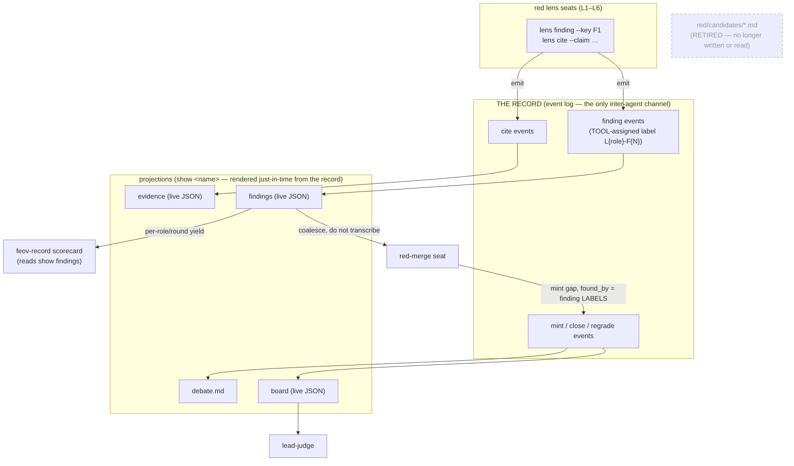
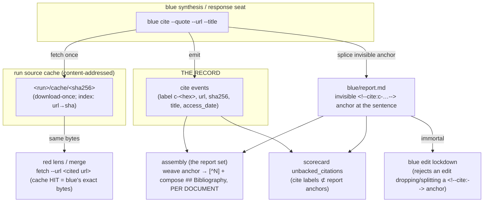

# The record flow — event → record → views → seats

The canonical channel between seats is the **record** (the append-only event log, written
only through `feov-record`). Non-prose actions — findings, citations, gaps, closures,
motions, opinions — are events; the markdown files are *projections* of the record for a
human reading afterward, never the channel. This diagram is kept current with the code
([[fuzzers-and-diagrams-track-code]]); update it in the same PR as any record/protocol change.

## Findings & citations onto the record (#62 pt1, #70/#71)

## Invariants the diagram encodes

- **Findings are events, not files.** A lens records each finding through `feov-record
  finding --key <local F1>`; the tool assigns the run-unique label `L{role}-F{N}` (role from
  the seat id). `red/candidates/*.md` is retired — nothing writes or reads it.
- **The merge reads the findings VIEW**, structured JSON, and coalesces findings into gaps.
  A gap's `found_by` names finding **labels** (`L1-F1`), which `verify.foundByResolves`
  checks against the recorded findings.
- **Two readers of one replay never drift.** `viewjson.go` (the live JSON views) and
  `internal/view` (the markdown projections, rendered just-in-time on read) both derive from
  `BoardState`; neither parses the other's output, and neither materializes to disk.
- **citations_checked** is the board's `counts.citations` (a tally of `cite` events), not a
  self-report (#70/#71 — the citation half of this same migration).

## The bibliography core — fetch → cache → cite → weave (#256, 0.28.0)

Citations are tool-managed end to end: blue never hand-types a footnote. A source is fetched
**once** to a hash-addressed cache both sides read; `blue cite` splices an invisible immortal
`<!--cite:c-…-->` anchor at the cited sentence; assembly resolves those anchors into a visible
bibliography in EACH DOCUMENT OF THE REPORT SET that carries them — a footnote definition cannot
cross a file boundary, so the layer is woven per file, never globally and split afterwards. The
set of `cite` events is a strict **bijection** with the anchors in the document — the lockdown
forbids removing one by a raw edit — so the record shows exactly what the report cites.

Invariants this encodes:
- **`fetch` replaces WebFetch for every seat** — a cached, hash-verified read; a second fetch of a URL
  is a cache hit, so red audits the exact bytes blue cited, never a page that drifted since.
- **A citation is an invisible immortal anchor**, spliced by the same `lens.InsertAnchor` machinery as a
  finding marker — but RESOLVED at assembly (finding markers are stripped).
- **cite events ⟺ `<!--cite:-->` anchors is a strict bijection** — the blue-edit lockdown's guard is
  class-swept to the finding∪citation union, so no raw edit can drop a citation; `unbacked_citations`
  flags any divergence (a hand-typed footnote, a tampered anchor).
- **The claim unit is the cite anchor** — `count-claims` counts a sentence carrying a `<!--cite:-->`
  anchor; the hand-typed `[^label]` footnote is retired. Nothing counts the assembled report.

## Out of scope (separate concepts)

`blue/candidates/` (blue best-of-N lane drafts) is unrelated and untouched. `#62 pt2`
(de-editorialising the merge via `supersedes`/tool-side dedup) is a later change.
