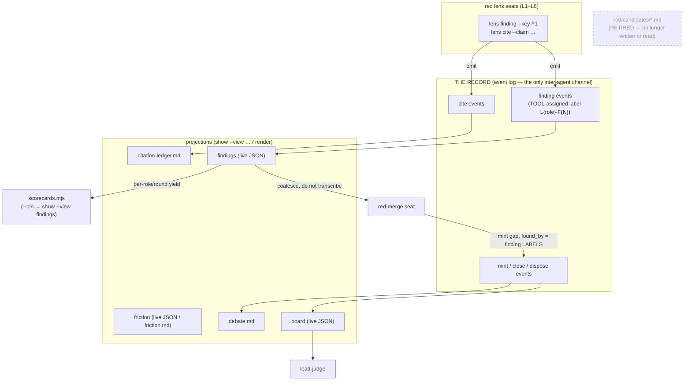

# The record flow — event → record → views → seats

The canonical channel between seats is the **record** (the append-only event log, written
only through `feov-record`). Non-prose actions — findings, citations, gaps, closures,
disputes, opinions — are events; the markdown files are *projections* of the record for a
human reading afterward, never the channel. This diagram is kept current with the code
([[fuzzers-and-diagrams-track-code]]); update it in the same PR as any record/protocol change.

## Findings & citations onto the record (#62 pt1, #70/#71)

## Invariants the diagram encodes

- **Findings are events, not files.** A lens records each finding through `feov-record lens
  finding --key <local F1>`; the tool assigns the run-unique label `L{role}-F{N}` (role from
  the seat id). `red/candidates/*.md` is retired — nothing writes or reads it.
- **The merge reads the findings VIEW**, structured JSON, and coalesces findings into gaps.
  A gap's `found_by` names finding **labels** (`L1-F1`), which `verify.foundByResolves`
  checks against the recorded findings.
- **Two readers of one replay never drift.** `viewjson.go` (the live views) and `render.go`
  (the markdown projections) both derive from `BoardState`; neither parses the other's output.
- **citations_checked** is the board's `counts.citations` (a tally of `cite` events), not a
  self-report (#70/#71 — the citation half of this same migration).

## Out of scope (separate concepts)

`blue/candidates/` (blue best-of-N lane drafts) is unrelated and untouched. `#62 pt2`
(de-editorialising the merge via `supersedes`/tool-side dedup) is a later change.
