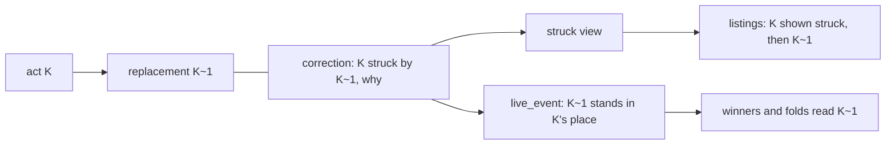
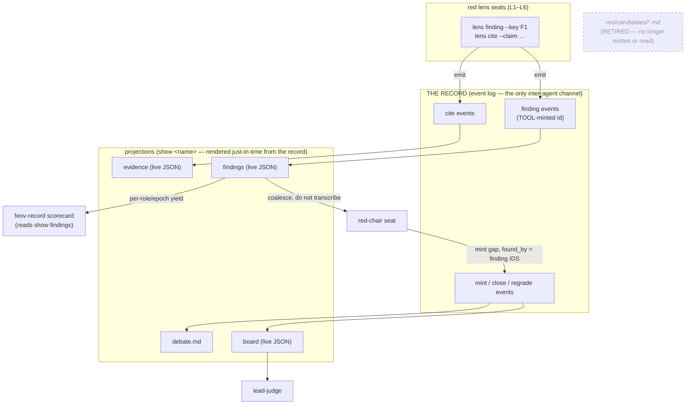

# The record flow — event → record → views → seats

The canonical channel between seats is the **record** (the append-only event log, written
only through `feov-record`). Non-prose actions — findings, citations, gaps, closures,
motions, opinions — are events; the markdown files are *projections* of the record for a
human reading afterward, never the channel. This diagram is kept current with the code
([[fuzzers-and-diagrams-track-code]]); update it in the same PR as any record/protocol change.

## A same-sitting correction

Append-only holds for a correction too. A seat whose act came out wrong re-runs the act's own verb with
what it meant and `--corrects <key>` (the key its success line printed); the tool writes the
replacement and a `correction` event in one transaction, and only while the act is the seat's own,
from this sitting, and no other seat has acted since. The re-run repeats every flag, as a new act
takes them: a flag the verb requires is refused if left out, a flag whose recorded value the
correction may not move is refused as a change, and wording the act holds is refused if left out —
it is dropped only by passing its flag empty, where the verb takes it empty. Only what the tool
assigned or computed (an id, a hash, a re-run's outputs) is taken from the corrected act. Nothing is edited: every view reads the acts
that stand (`live_event` in SQL, `Live` in Go), and every listing shows the first act struck
beside its replacement (`struck`, `Listing`).

```mermaid
flowchart LR
  A[act K] --> R[replacement K~1]
  R --- C[correction: K struck by K~1, why]
  C --> S[struck view]
  C --> L[live_event: K~1 stands in K's place]
  S --> V[listings: K shown struck, then K~1]
  L --> W[winners and folds read K~1]
```

## Findings & citations onto the record (#62 pt1, #70/#71)

```mermaid
flowchart TB
  subgraph lenses["red lens seats (L1–L6)"]
    L["lens finding --key F1<br/>lens cite --claim …"]
  end
  subgraph record["THE RECORD (event log — the only inter-agent channel)"]
    FE["finding events<br/>(TOOL-minted id)"]
    CE["cite events"]
    ME["mint / close / regrade events"]
  end
  subgraph views["projections (show &lt;name&gt; — rendered just-in-time from the record)"]
    FV["findings (live JSON)"]
    CL["evidence (live JSON)"]
    BD["board (live JSON)"]
    DBT["debate.md"]
  end
  chair["red-chair seat"]
  score["feov-record scorecard<br/>(reads show findings)"]
  bench["lead-judge"]

  L -->|emit| FE
  L -->|emit| CE
  FE --> FV
  CE --> CL
  ME --> BD
  FV -->|coalesce, do not transcribe| chair
  chair -->|mint gap, found_by = finding IDS| ME
  FV -->|per-role/epoch yield| score
  BD --> bench
  ME --> DBT

  X["red/candidates/*.md<br/>(RETIRED — no longer written or read)"]
  class X retired
  classDef retired stroke-dasharray:5 5,color:#999,stroke:#999
```

## Invariants the diagram encodes

- **Findings are events, not files.** A lens records each finding through `feov-record
  finding --key <your handle>`; the tool mints the finding's id, and the lens's area prints
  beside it wherever it is named. `red/candidates/*.md` is retired — nothing writes or reads it.
- **The chair reads the findings VIEW**, structured JSON, and coalesces findings into gaps.
  A gap's `found_by` names finding **ids**, which `verify.foundByResolves`
  checks against the recorded findings.
- **Two readers of one replay never drift.** `viewjson.go` (the live JSON views) and
  `internal/view` (the markdown projections, rendered just-in-time on read) both derive from
  `BoardState`; neither parses the other's output, and neither materializes to disk.
- **citations_checked** is the board's `counts.citations` (a tally of `cite` events), not a
  self-report (#70/#71 — the citation half of this same migration).

## The bibliography core — fetch → cache → cite → weave

Citations are tool-managed end to end, and the whole path — fetch, the run cache, `cite`, red's
checks, and assembly into notes and a Bibliography — has its own page, with the known faults of each
step: **[citations-and-bibliography.md](citations-and-bibliography.md)**. What this flow depends on:

- **A citation is a record event, and its marker is an insert op.** `cite` records the event and a
  marker insertion at the quoted sentence; the report is its frozen base plus the replayed ops, so
  there is no file to splice and no torn-splice window.
- **cite events ⟺ `<!--cite:-->` anchors is a strict bijection.** `blue edit` refuses a span that
  drops or splits an anchor of any kind, and `unbacked_citations` flags any divergence.
- **The claim unit is the cite anchor** — `count-claims` counts a sentence carrying one; nothing
  counts the assembled report.

## Out of scope (separate concepts)

`blue/candidates/` (blue best-of-N lane drafts) is unrelated and untouched. `#62 pt2`
(de-editorialising the chair via `supersedes`/tool-side dedup) is a later change.
