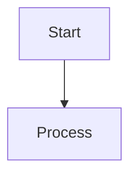

# Markdown Proficiency & Advanced Shorthand

This cheatsheet defines advanced, high-leverage Markdown and GitHub Flavored Markdown (GFM) features. You MUST utilize these structures when creating documentation, artifacts, or responses that require rich formatting.

## 1. Collapsible Content (Details/Summary)

Use HTML `<details>` tags to hide verbose output, long code snippets, or secondary information. This keeps the primary view clean.

```html
<details>
  <summary>Click to expand for deep dive</summary>

  Hidden verbose content goes here.
</details>
```

## 2. Alerts (Callouts)

Use blockquote syntax to create distinct UI callouts for emphasis rather than just relying on bold text.

```markdown
> [!NOTE]
> Background context or general information.

> [!TIP]
> Best practices or alternative approaches.

> [!WARNING]
> Critical content that requires attention.
```

## 3. UI Keyboards & Visuals

- **Keyboard Shortcuts**: Represent keystrokes using `<kbd>Ctrl</kbd> + <kbd>C</kbd>`.
- **Diff Blocks**: To show code structural changes without writing a full script, use `diff` syntax:
  ```diff
  - old_function()
  + new_function()
  ```

## 4. Tables and Spacing

- **Line Breaks in Cells**: Standard markdown tables don't support newlines. Use the `<br>` tag inside a cell to force a line break.
- **Forced Spacing**: Use `&nbsp;` to force indentations or spaces in tight constraints.

## 5. Footnotes & Citations

Use semantic, word-based footnotes to cite sources or provide tangential notes without interrupting the flow of the primary sentence. This follows the Extended Markdown syntax and ensures that citations remain meaningful during drafting.

```markdown
The Culture novels treat a good argument as an act of respect.[^BanksCulture]

[^BanksCulture]: [Wikipedia — The Culture](https://en.wikipedia.org/wiki/The_Culture) - Accessed 2026-07-12.
```

## 6. Official Documentation & References

For comprehensive Markdown standards, refer to the following authoritative sources:
- **Markdown Cheat Sheet**: [https://www.markdownguide.org/cheat-sheet/](https://www.markdownguide.org/cheat-sheet/)
- **Extended Syntax (Footnotes)**: [https://www.markdownguide.org/extended-syntax/#footnotes](https://www.markdownguide.org/extended-syntax/#footnotes)

## 7. Diagramming (Mermaid)

Use Mermaid to construct visual graphs of architecture or state machines.
_Rule_: Always quote labels that contain special characters (e.g., `id["Complex (Label)"]`) to prevent syntax errors.



## 7. Hidden Comments

Use standard HTML comments to leave notes for yourself or future subagents that should not render in the final user-facing output.

```markdown
<!-- TODO: Parent agent needs to review this edge case -->
```
